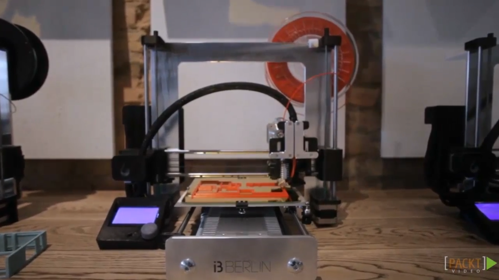
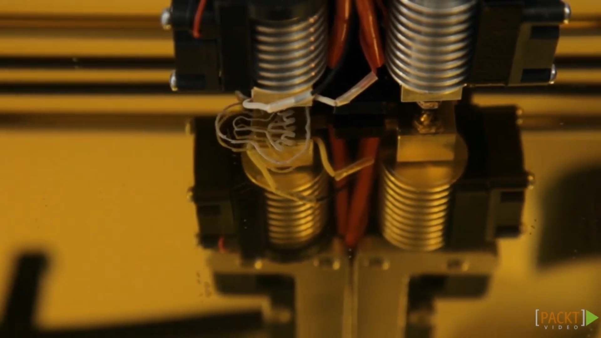
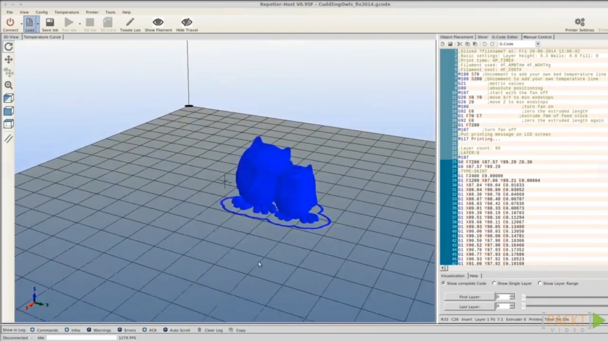
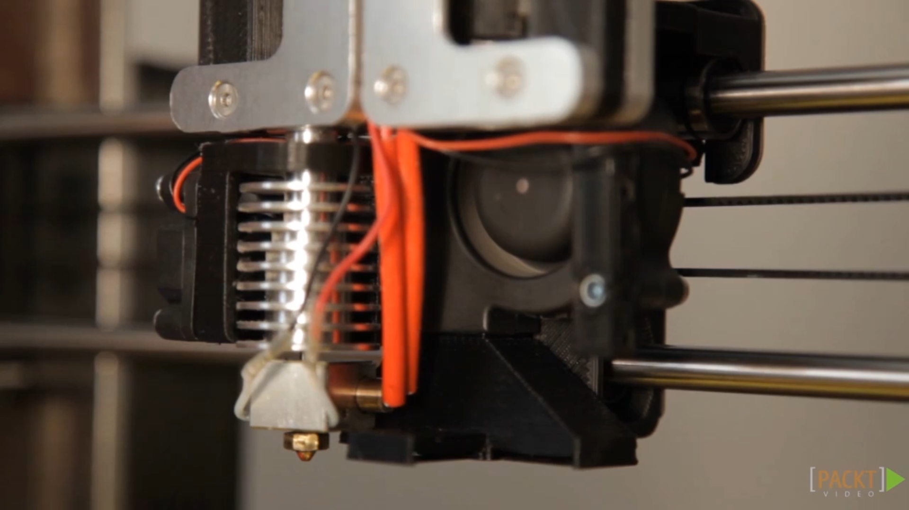

1. [Introduction to RepRap](#1)
2. [How a 3D Printer Works](#2)
3. [3D Printing Workflow](#3)
4. [Overview of the i3 Berlin 3D Printer Design](#4)
5. [Tools and Parts](#5)

---

### 1. Introduction to RepRap

#### i3 Berlin

- Source Repository [https://github.com/open3dengineering/i3_Berlin] Here you will find all source files of all the hardware and firmware.
- Written Manual [https://github.com/open3dengineering/i3_Berlin/wiki] In addition to the video you can find the written manual, which will always be up to date.
- Buy a Kit [https://www.laydrop.com/en/] Laydrop. The webshop of the video authors.
- Open 3D Engineering [www.open3dengineering.org] The development website of the video authors.

#### Software

- Arduino [http://arduino.cc/] The program to edit and upload the firmware.
- Repetier [http://www.repetier.com/] A printer driver to control your printer from the computer.
- Pronterface [] A printer driver to control your printer from the computer.
- Slic3r [http://slic3r.org/] Open Source pathgenerator for slicing 3D models
- Cura [http://software.ultimaker.com/] Open Source pathgenerator for slicing 3D models
- Kisslicer [http://www.kisslicer.com/] Restricted freeware pathgenerator. License fee of $42,- unlocks all features.
- Blender [http://www.blender.org/] 3D modeling and animation program. This software is used to design the i3 Berlin.
- Freecad [http://sourceforge.net/projects/free-cad/] Open Source CAD software for parametric modelling.
- OpenSCAD [http://www.openscad.org/] Line based CAD modeller frequently used in the community.
- Marlin wiki [] A list of all the Gcodes that can be send to the printer. Useful for custom Gcodes at the start and end of the print.
- Meshmixer [http://www.meshmixer.com/] intuitive virtual sculpting
- Taurino Drivers [ftp://ftp.open3dengineering.org/pub/Taurino_USB_Driver_Windows/RRD_RUMBA_TAURINO_DriverSetup.exe] Drivers for windows needed for your RAMPS.
- Linux issues for Repetier [https://github.com/repetier/Repetier-Host/issues/156#issuecomment-15350723] This forum explains the solution to fix the Mono libraries.
- Linux issues for Pronterface [http://forums.reprap.org/read.php?1,163707,225478] This forum explains the solution to connect to your printer with Pronterface.

#### Community Resources

- RepRap [http://reprap.org/wiki/RepRap] The project's home site with a vast wiki on all 3D printer related issues.
- Wealth without money [http://reprap.org/wiki/Wealth_Without_Money] The manifesto that started the RepRap movement.
- RepRap Magazine [http://reprapmagazine.com/] Online glossy about the latest ins and outs for open 3D printing.
- IRC [http://reprap.org/wiki/IRC] Active online chat room for all your questions.
- RichRap [http://richrap.blogspot.de/] Nice blog about his adventures in 3D printing.
- Nophead [http://hydraraptor.blogspot.de/] Another nice blog.

#### Inspiration

- Thingiverse [http://www.thingiverse.com/] Loads and loads of freely downloadable stuff to print.
- Yahoo [http://groups.yahoo.com/neo/groups/diy_3d_printing_and_fabrication/info] Yahoo group about DIY 3D printing.
- 3ders.org [http://www.3ders.org/] Latest news about 3D printing.
- Universal paste extruder [http://www.thingiverse.com/thing:20733] model of the universal paste extruder.
  Chocolate extruder [http://www.thingiverse.com/thing:18017] 3D files of the chocolate extruder.
- Netfabb [http://www.netfabb.com/] repair stl files to make them printable.

- [Link and reference docx](https://github.com/joysmith/Build-your-own-open-source-3D-printer-over-the-weekend/blob/main/01%20Introduction/resources/Links%20and%20References.doc)

 

### 2. How a 3D Printer Works

Notes:

- The Extruder move left & right
- The platform move front & back

### 3. 3D Printing Workflow

1. 3D modelling
1. Export as .obj/.stl file
1. Load in the 3D-printer software
1. Perform some setting or fine tuning
1. Load the g-code to sd card
1. Put sd-card inside 3D-printer
1. Print the model
1. After cool down remove it from print plate

### 4. Overview of the i3 Berlin 3D Printer Design

### 5. Tools and Parts

