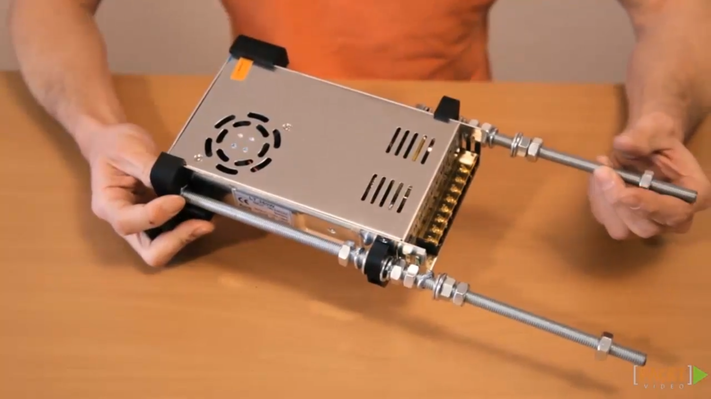

6. [Mounting the Threaded Rods and Power Supply](#6)
7. [Mounting the Aluminium Plates and the Y-motor](#7)
8. [Mounting the Y-carriage and the Timing Belt](#8)
9. [Adjusting the Parallels](#9)

---

### 6. Mounting the Threaded Rods and Power Supply

### 7. Mounting the Aluminium Plates and the Y-motor

### 8. Mounting the Y-carriage and the Timing Belt

### 9. Adjusting the Parallels

