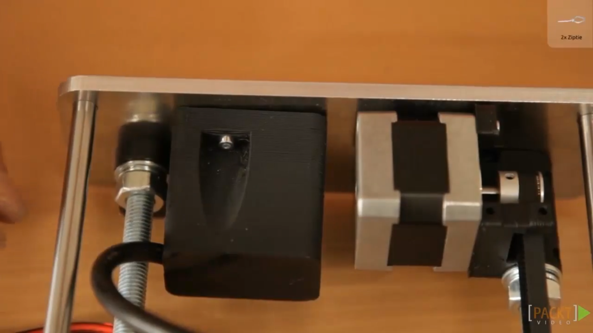
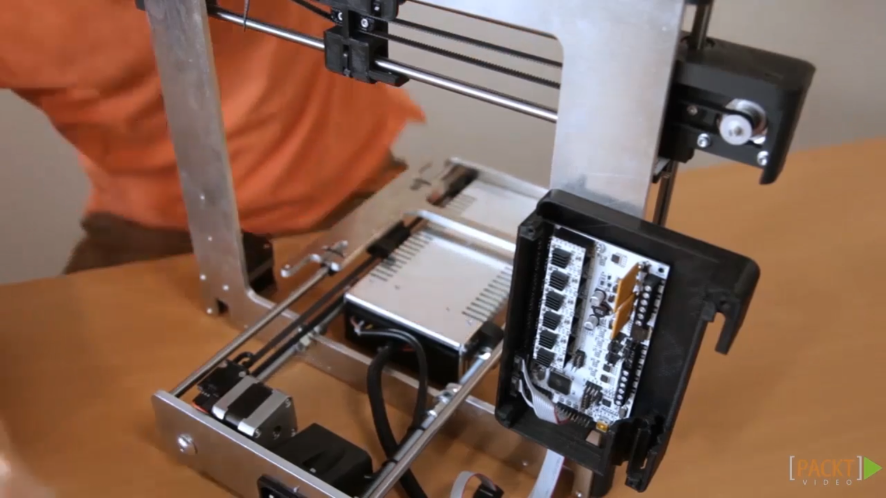
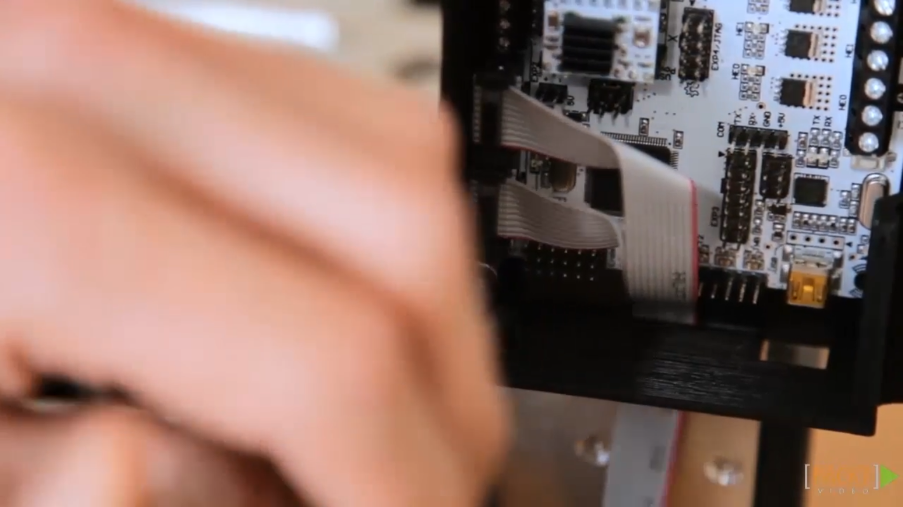
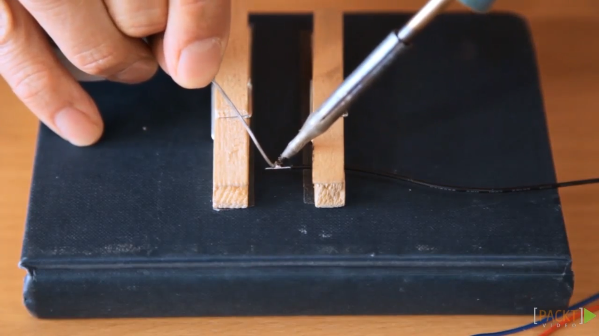

13. [Wiring the Power Supply](#13)
14. [Assembly of the Main Units](#14)
15. [Wiring the Y-unit](#15)
16. [Wiring the Z-unit](#16)
17. [Wiring the X-unit and the Extruder](#17)
18. [Wiring the HeatBed](#18)

---

### 13. Wiring the Power Supply

### 14. Assembly of the Main Units

### 15. Wiring the Y-unit

### 16. Wiring the Z-unit

### 17. Wiring the X-unit and the Extruder

### 18. Wiring the HeatBed
