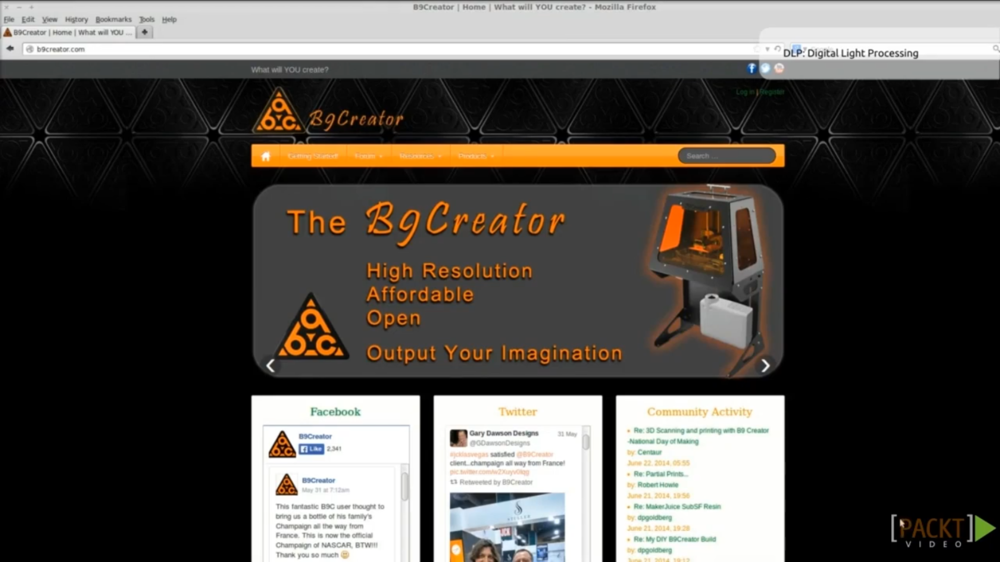
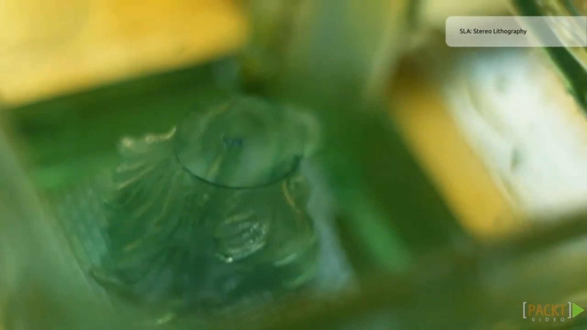

30. [Cura](#30)
31. [Kisslicer](#31)
32. [Filaments](#32)
33. [Print Platform Surface](#33)
34. [Extruders](#34)
35. [The Future of Open Source 3D Printing](#35)

---

### 30. Cura<a id='30'>

### 31. Kisslicer<a id='31'>

### 32. Filaments<a id='32'>

### 33. Print Platform Surface<a id='33'>

### 34. Extruders<a id='34'>

### 35. The Future of Open Source 3D Printing<a id='35'>

